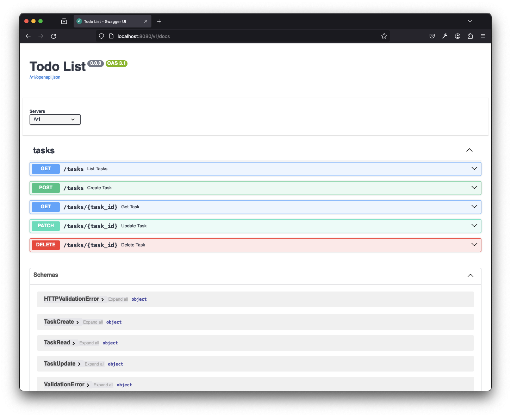

# Python API Starter

[](https://github.com/CameronXie/python-api-starter/actions/workflows/test.yaml)

This project aims to serve as a practical example of how to build a RESTful API in Python by showcasing a To-Do List API
tool.

## Folder Structure

```shell
.
├── Makefile
├── README.md
├── docker
│   └── dev
├── docker-compose.yaml
├── docs
│   └── openapi_docs.png
├── poetry.lock
├── pyproject.toml
├── src
│   └── app
│       ├── __init__.py
│       ├── api.py
│       ├── config.py
│       ├── exception_handlers.py
│       ├── main.py                  # Entry point to API
│       └── tasks                    # Task related resources
├── stack
│   └── cfn
│       └── api.yaml                 # IaC Cloudformation template
└── tests
    ├── __init__.py
    └── app                          # Unit tests
```

## Development

This project is built with Docker to handle the local development environment smoothly. To initiate the development
container, execute the command `make up`.

Inside the `python_api_dev` container, run `poetry install` for installing all the necessary dependencies. After
completion, type `make server` to launch the Todo list API within the container. Following this, you can access the API
via your web browser at https://localhost:8080/v1. Additionally, the OpenAPI documentation for the API can be accessed
at https://localhost:8080/v1/docs.



## Deployment

The solution leverages the capabilities of AWS API Gateway and AWS Lambda services. To deploy the Todo List API to AWS,
simply run the `make deploy` command.

## Test

To test the lambda source code, cloudformation template and Github actions file, use the `make test` command. This
performs type checking, linting, and unit tests. Ensure to resolve any highlighted issues before proceeding to
deployment.
